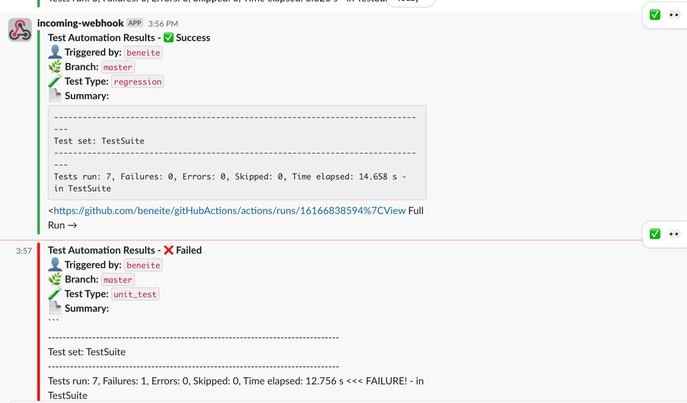

This GitHub Actions workflow named `p23_slack_notification` is designed to **manually trigger test execution** and then **publish the results to Slack** using a Docker-based Slack Notifier.

Here’s a **breakdown of how it works**:



---

## ✅ **Workflow Trigger**

```yaml
on:
  workflow_dispatch:
```

* Allows manual trigger via GitHub Actions UI.
* Accepts an input `testType` with options: smoke, regression, sanity, unit\_test.

---

## 🧪 **Job: `trigger-tests`**

```yaml
jobs:
  trigger-tests:
    runs-on: ubuntu-latest
```

Runs the job on a Linux GitHub-hosted runner.

---

### 🧩 Step-by-step Breakdown:

---

### **1. Checkout the repo**

```yaml
- name: Checkout Code
  uses: actions/checkout@v4
```

Pulls the latest code from the repo.

---

### **2. Setup Java and Maven**

```yaml
- name: Setup Java and Maven
  uses: actions/setup-java@v3
```

Sets up JDK 17 using Temurin distribution for compiling and running Java tests.

---

### **3. Run Tests Based on Input**

```bash
mvn clean test -Dsuite=smokeTestSuite.xml
```

Based on `testType`, the appropriate suite file is used to run tests.

> ✅ Handles all 4 test types with a fallback for failing tests in `unit_test`.

---

### **4. Wrap Up and Display Results**

```bash
cat target/surefire-reports/TestSuite.txt
```

Prints the test result summary to console.

---

### **5. Read Summary Into Output Variable**

```yaml
id: test_summary
echo "summary<<EOF" >> $GITHUB_OUTPUT
```

Stores the full contents of `TestSuite.txt` in a GitHub Actions output variable (`summary`) so it can be reused later.

---

### **6. Set Slack Message Color**

```yaml
id: slack_color
if [ "${{ job.status }}" == "success" ]
```

* Green color `#36a64f` for success
* Red color `#ff0000` for failure

Color is saved in the `color` output variable.

---

### **7. Post to Slack via Docker Image**

```yaml
uses: docker://technosophos/slack-notify
```

* Uses a lightweight Docker container to post to Slack.
* Uses `SLACK_WEBHOOK` (defined in GitHub Secrets).
* Message includes:

    * 👤 GitHub user who triggered
    * 🌿 Branch name
    * 🧪 Test type
    * 📄 TestSuite.txt output inside a code block
    * 🔗 Link to view full run on GitHub

---

## 📝 Slack Message Example

```
Test Automation Results - ✅ Success
👤 Triggered by: ashish
🌿 Branch: manualTriggerBranch
🧪 Test Type: regression
📄 Summary:
```

Tests run: 4, Failures: 0, Errors: 0, Skipped: 0...

🔗 View Full Run → \[link]

```

---

## ✅ Summary

This is a clean, end-to-end test reporting pipeline that:
- Accepts inputs
- Runs tests
- Extracts summary
- Notifies team on Slack with a clean formatted message

---

Let me know if you'd like to:
- Attach test artifacts (e.g., HTML report)
- Split success vs failure notifications
- Show runtime duration in Slack
- Trigger on push/PR as well
```
